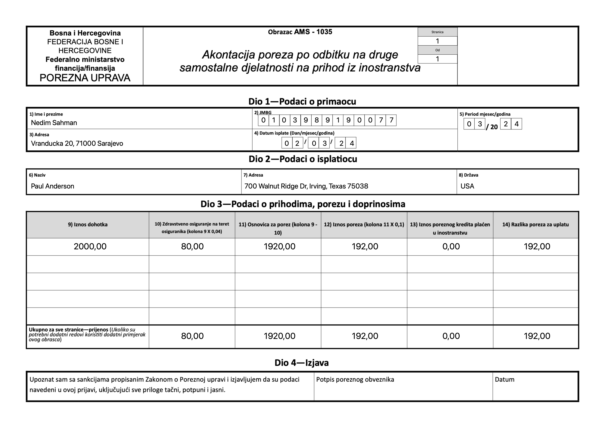

# AMS Generator

This script generates an invoice with provided information and saves it as an image file.

## Usage

To use this script, follow the steps below:

1. Ensure you have the necessary dependencies installed. This script requires macOS and the Cocoa framework.

2. Clone or download the repository containing the script.

3. Open Terminal on your macOS system.

4. Navigate to the directory containing the script.

5. Run the script with the following command:

```
swift AMS.swift [flags]
```

Replace [flags] with the desired command-line flags and their values. The available flags are:

* '-n [name]': Specifies the name of the invoice recipient.
* '-a [address]': Specifies the address of the invoice recipient.
* '-i [identificationNumber]': Specifies the identification number of the invoice recipient.
* '-d [date]': Specifies the date of the invoice in the format "dd.MM.yyyy".
* '-m [monthYear]': Specifies the month and year of the invoice in the format "MM.yyyy".
* '-p [payerName]': Specifies the name of the payer.
* '-pa [payerAddress]': Specifies the address of the payer.
* '-pc [payerCountry]': Specifies the country of the payer.
* '-amount [amount]': Specifies the payment amount.
* '-deduction [deduction]': Specifies the deduction amount.

If any of the flags related to the user (-n, -a, -i) or to the payer (-p, -pa, -pc) are not provided, the script will attempt to read the configuration from a file named 'config.env'. The file should contain key-value pairs in the format:

```
# User information
NAME=Nedim Sahman
ADDRESS=Vranducka 20, 71000 Sarajevo
IDENTIFICATION_NUMBER=0103989190077

# Payer information
PAYER_NAME=Paul Anderson
PAYER_ADDRESS=700 Walnut Ridge Dr, Irving, Texas 75038
PAYER_COUNTRY=USA
```

If the -d (date) or -m (month and year) flags are not provided, they will be automatically added using the current date and month/year, respectively.

Additionally, if the user is entitled to a 20% expense allowance, they will use the -deduction flag in this format: -deduction 20. Otherwise, they will omit this flag.

## Example

After running the script, the generated invoice image will be saved in the Resources folder as output.jpg. In our case this is the result:

<p align="center">
  
</p>

## Author
[Raif Agović](https://twitter.com/raifagovic)

## License
AMS Generator is licensed under the MIT license. Check the [LICENSE](https://github.com/raifagovic/ams-generator/blob/main/LICENSE) file for details.
